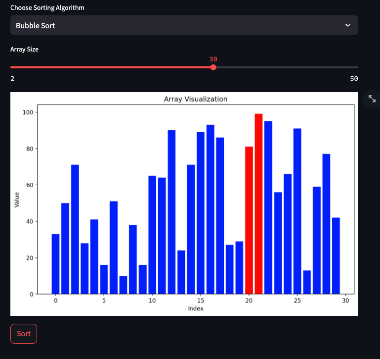

# Sorting Algorithm Visualization 


## Overview
This Streamlit web application visualizes various sorting algorithms in action, allowing you to interactively explore how each algorithm sorts random arrays.

## Demo

You can access the live demo of this project [here](https://tymoteuszmilek-sorting-visualization-main-knhseu.streamlit.app).

## Features
- **Interactive UI:** Choose from a variety of sorting algorithms.
- **Adjustable Parameters:** Change the array size and animation delay.
- **Real-Time Visualization:** Watch how the array gets sorted step-by-step.

## Sorting Algorithms Implemented
- Quick Sort
- Merge Sort
- Selection Sort
- Insertion Sort
- Bubble Sort

## How to Use
1. **Setup:**
    - Ensure you have Python and pip installed on your machine.
    - Clone the repository:
      ```bash
      git clone https://github.com/tymoteuszmilek/sorting-visualization.git
      cd sorting-visualization
      ```
    - Install the required dependencies:
      ```bash
      pip install -r requirements.txt
      ```

2. **Run the Application:**
    - Start the Streamlit app:
      ```bash
      streamlit run main.py
      ```
    - Open the web browser and go to 'localhost:8501' to view the app.

3. **Interact with the App:**
    - Select a sorting algorithm from the dropdown menu.
    - Adjust the array sizeusing the provided slider.
    - Click the "Sort" button to see the algorithm in action.
